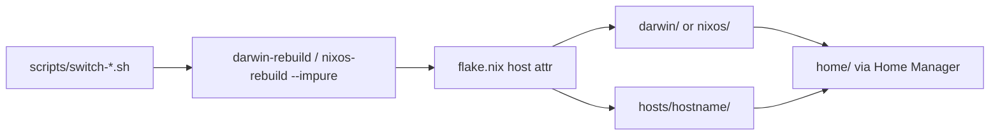

# nix-config

Declarative system configuration for **macOS** (nix-darwin) and **NixOS**, with a shared Home Manager layer. Containers use **Podman Desktop** on both platforms (not Docker Desktop).

This is a customized fork by [Anand Magaji](https://magaji.dev).

## Getting started

Clone path must be `~/Documents/GitHub/nix-config` — out-of-store dotfile symlinks and rebuild aliases use that absolute path.

```bash
mkdir -p ~/Documents/GitHub
git clone https://github.com/anhedonix/nix-config.git ~/Documents/GitHub/nix-config
cd ~/Documents/GitHub/nix-config
```

### macOS

```bash
# 1) Install Nix (Determinate). Restart the terminal afterward.
curl --proto '=https' --tlsv1.2 -sSf -L https://install.determinate.systems/nix | sh -s -- install

# 2) Optional but recommended before first switch: back up conflicting paths
#    e.g. ~/.config/{doom,nvim,zed,gh,lazygit,karabiner,fish} ~/.bashrc ~/.bash_profile ~/.profile

# 3) Apply the system + Home Manager config
./scripts/switch-mac.sh
# equivalent: ./scripts/switch-mac.sh amagaji amagaji-mac

# 4) Reload the shell (or open a new terminal)
exec zsh
# later rebuilds: sdr
```

Homebrew is managed by nix-homebrew / nix-darwin (migrates an existing install if present). This flake sets `nix.enable = false` on Darwin so the Determinate installer owns Nix.

### NixOS

```bash
# 1) On a fresh install, generate real hardware config and replace the placeholder
sudo nixos-generate-config --show-hardware-config > hosts/tp14s/hardware-configuration.nix

# 2) Optional: back up conflicting home paths (same idea as macOS)

# 3) Apply
./scripts/switch-linux.sh
# equivalent: ./scripts/switch-linux.sh amagaji tp14s

# 4) Reload the shell
exec zsh
# later rebuilds: snr
```

### Overrides

```bash
./scripts/switch-mac.sh <username> <hostname>
./scripts/switch-linux.sh <username> <hostname>
```

Scripts export `PRIMARY_USER` and rebuild with `--impure` so the username can be overridden at runtime. The hostname must match a flake output (`amagaji-mac` or `tp14s`).

### After the first switch

- **Git SSH signing:** run `gss` (or `ensure-git-ssh-signing`) if needed; interactive zsh also auto-runs it when the signing key/marker is missing.
- **mise:** activation installs global tools (`node@lts`, `bun@latest`, `uv@latest`, `rust@stable`).
- **Doom Emacs:** once `emacs` is on your `PATH` and `~/.config/doom` is linked, the next switch runs a one-shot install into `~/.config/emacs`.

## How it works



| Layer | Role |
|-------|------|
| [`flake.nix`](flake.nix) | Outputs `darwinConfigurations.amagaji-mac` and `nixosConfigurations.tp14s`; reads `PRIMARY_USER` (default `amagaji`) |
| [`darwin/`](darwin/) | macOS system modules, nix-homebrew, fonts, defaults |
| [`nixos/`](nixos/) | NixOS system modules, Podman + Flatpak Podman Desktop |
| [`home/`](home/) | Shared Home Manager: packages, shell, git, mise, fonts, dotfiles |
| [`hosts/`](hosts/) | Per-machine hostname, hardware, and host-only extras |

Dotfiles under [`home/dotfiles/`](home/dotfiles/) are linked with `mkOutOfStoreSymlink`, so edits in the repo apply immediately. Shell, git, mise, and Starship are native Home Manager options (a rebuild is required for those).

## Repository layout

```
nix-config/
├── flake.nix                      # darwinConfigurations.amagaji-mac + nixosConfigurations.tp14s
├── scripts/
│   ├── switch-mac.sh              # darwin-rebuild (user/host args)
│   └── switch-linux.sh            # nixos-rebuild (user/host args)
├── darwin/                        # macOS system modules + Homebrew
├── nixos/                         # NixOS system modules + Podman/Flatpak
├── home/                          # Shared Home Manager modules
│   └── dotfiles/                  # Symlinked configs (nvim, doom, zed, …)
└── hosts/
    ├── amagaji-mac/               # aarch64-darwin host
    └── tp14s/                     # x86_64-linux NixOS host (+ hardware placeholder)
```

## Day-to-day commands

| Command | Platform | Purpose |
|---------|----------|---------|
| `sdr` | macOS | Rebuild via `scripts/switch-mac.sh` |
| `snr` | Linux | Rebuild via `scripts/switch-linux.sh` |
| `gss` | both | Ensure GitHub SSH commit signing (`ensure-git-ssh-signing`) |
| `zvi` | both | Edit `home/shell.nix` in neovim |
| `srz` | both | `source ~/.zshrc` |
| `ls` / `ll` / `l` | both | `eza` variants |
| `cd` | both | `z` (zoxide) |
| `cat` | both | `bat` |
| `rm` | both | `rip` (rm-improved) |
| `cp` / `mv` | both | interactive (`-iv`) |
| `~` `..` `...` `....` | both | navigation shortcuts |
| `untar` | both | `tar -zxvf` |
| `brew` | macOS | Stub — edit [`darwin/homebrew.nix`](darwin/homebrew.nix) instead |

Starship prompt uses a `λ` character for success/error.

## Default installed software

### CLI (nixpkgs, both platforms)

From [`home/packages.nix`](home/packages.nix): `curl`, `neovim`, `tmux`, `htop`, `btop`, `tree`, `ripgrep`, `zoxide`, `eza`, `bat`, `rm-improved`, `gh`, `mise`, `nil`, `biome`, `nixfmt-rfc-style`, `yt-dlp`, `ffmpeg`.

macOS host extra ([`hosts/amagaji-mac/configuration.nix`](hosts/amagaji-mac/configuration.nix)): `graphite-cli`.

### mise globals

`node@lts`, `bun@latest`, `uv@latest`, `rust@stable`.

### macOS Homebrew

From [`darwin/homebrew.nix`](darwin/homebrew.nix):

| Kind | Packages |
|------|----------|
| Casks | Aerospace, Hidden Bar, Raycast, Karabiner-Elements, BetterDisplay, CleanShot, Figma beta, Cursor, Podman Desktop, Ghostty, VS Code, Zed, GitHub Desktop, Git Credential Manager, Discord, Slack beta, Signal, 1Password, Brave, Zen, Anki, Freeplane, Obsidian, JDownloader, Spotify |
| Brews | `podman`, `prettier` |
| Tap | `nikitabobko/tap` (Aerospace) |
| MAS | WhatsApp, GoodNotes3 |

### NixOS containers

Podman with `dockerCompat` (no Docker daemon) and Flatpak Podman Desktop (`io.podman_desktop.PodmanDesktop`) via [`nixos/podman.nix`](nixos/podman.nix).

### Fonts

DejaVu; Nerd Fonts (Iosevka, Fira Code, Fira Mono, Go Mono, JetBrains Mono, Sauce Code Pro); Source Code Pro.

### Managed dotfiles

Configs live under [`home/dotfiles/`](home/dotfiles/) and are linked by [`home/dotfiles.nix`](home/dotfiles.nix).

| Managed | Target |
|---------|--------|
| Doom Emacs user config | `~/.config/doom` |
| Neovim | `~/.config/nvim` |
| Zed settings | `~/.config/zed/settings.json` |
| GitHub CLI | `~/.config/gh/{config,hosts}.yml` |
| lazygit | `~/.config/lazygit/config.yml` |
| fish / bash / profile | `~/.config/fish/...`, `~/.bashrc`, `~/.bash_profile`, `~/.profile` |
| Podman containers.conf | `~/.config/containers/containers.conf` |
| Karabiner (macOS) | `~/.config/karabiner/karabiner.json` |
| Cursor settings (macOS) | `~/Library/Application Support/Cursor/User/settings.json` |

**First switch:** Home Manager refuses to overwrite existing non-HM files. Back up or remove conflicting paths before applying.

## Customization

| Change | Where |
|--------|--------|
| CLI tools | [`home/packages.nix`](home/packages.nix) |
| Symlinked configs | [`home/dotfiles/`](home/dotfiles/) + [`home/dotfiles.nix`](home/dotfiles.nix) |
| Mac GUI apps | [`darwin/homebrew.nix`](darwin/homebrew.nix) |
| Dev runtimes (mise) | [`home/mise.nix`](home/mise.nix) |
| Mac host extras | [`hosts/amagaji-mac/configuration.nix`](hosts/amagaji-mac/configuration.nix) |
| Linux host / hardware | [`hosts/tp14s/`](hosts/tp14s/) |

## Troubleshooting

- **Wrong OS:** each switch script refuses to run on the other platform.
- **Unknown flake attr:** hostname must match an output in `flake.nix` (`amagaji-mac` or `tp14s`).
- **NixOS hardware:** replace the placeholder `hardware-configuration.nix` before a real install.
- **Leftover Docker Desktop / Colima on Mac:** after switching to Podman, uninstall any non-Brew leftovers manually if needed.
- **Dotfile symlink conflicts:** remove or rename existing target files/dirs, then re-run the switch script.
- **Broken out-of-store links:** ensure the repo is checked out at `~/Documents/GitHub/nix-config`.

## Credits

Customized fork by [Anand Magaji](https://magaji.dev), based on [bgub/nix-macos-starter](https://github.com/bgub/nix-macos-starter).
